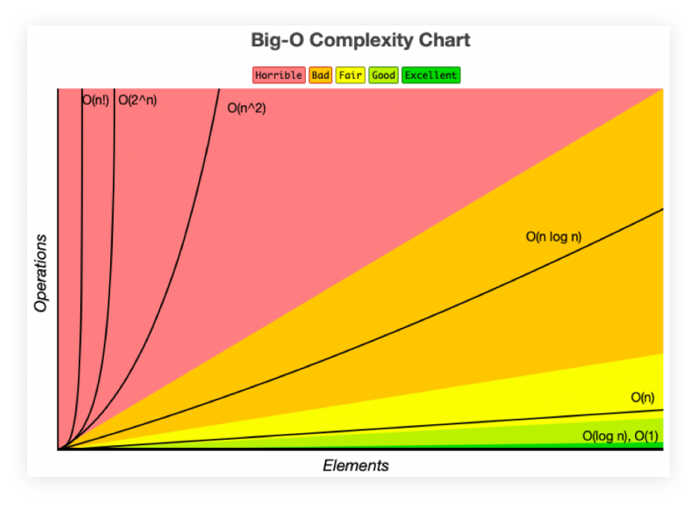

== 10 Searching Algorithms
:page-tags: algorithm data-structure search
:toc: left
:imagesdir: src/10-searching-algorithms

Some languages have things like `indexOf()` or `find()`.
But let's create our own search functions.

Linear search on unsorted arrays has linear time complexity: stem:[O(n)].

Binary Search on sorted arrays has logarithmic complexity: stem:[O(log₂ n)].

Naive string searching algorithm.

KMP string searching algorithm.

[data-tags="algorithm search linear-search"]
=== Linear Search

The naive approach is to look at the elements one by one until the value sought for is found or until the end of the array is reached.

For sorted arrays, looking from first to last element (one by one) is not a good performant way of going about it.

ECMAScript already provides linear search:

* `indexOf()`
* `includes()`
* `find()`
* `findIndex()`

Those are not optimized with some more performant search algorithm because the JavaScript engine would not know if the input array was sorted or not or because they need to return an index, which require counting each element already inspected.

[NOTE]
====
Linear search *IS NOT* bad.
It is not performant as some other searching algorithms, but sometimes it is the only algorithm that can be used on an unsorted array input.
====

[data-tags="search linear array index"]
==== search(arr, val)

* Create a function that accepts an array of numbers and a numeric value.
* Loop through the array from beginning to end comparing each element with the search value.
* If the current element matches the value:
** Return the index at which it was found.
* Return `-1` to indicate the value was not found in the array.

==== v1 using simple for loop

[source,typescript,linenums]
----
include::./linear-search-num/searchNum-v1.ts[lines=5..-1]
----

A `forEach()` cannot be stopped.
It iterates over each element, from beginning to end, and this algorithm is optimized at least in the sense that it stops as soon the element is found (if found it is).
`reduce()` cannot be stopped either.
A good old _for loop_ is OK for situations like this.

Linear search will seldom be stem:[O(1)].
That is very rare indeed.
Most likely, an element is found at stem:[1/3] of the way, or stem:[3/4] of the way, that is, _late_ or not at all, which means it is stem:[O(n)].

Remember that for Big O we care about the general trend.
As the search could go until the end of the array, we say linear search has time complexity of stem:[O(n)].

=== Binary Search

Much faster than linear search, but the *input has to be sorted*.
At each iteration, half of the array can be “eliminated”.

The idea is that an element in the middle is picked and then a comparison is performed to see if it is “less than or grater than” the element being sought for.
If greater than, discard the half that contains the less than elements.
If less than, discard the half that contains the greater than elements.
I each case, keep repeating a similar process with the half that could still potentially contain the element being searched for.

This idea is also known as _divide and conquer_.

[WARNING]
====
For binary search to work, *hhe input has to be sorted*.
====

.example rationale
----
Find 8

                     target element
                            \
                             \
                              v
  1   2   3   4   5   6   7   8   9   10   11
                      ^
                     /
                    /
            middle element
            8 > 6, discard left half
            keep searching right half

                              v
                          7   8   9   10   11
                                  ^
                                 /
                                /
                        middle element
                        8 < 9, discard right half
                        keep searching left half

                              v
                          7   8
                              ^
                             /
                            /
                       round up or down to pick middle element
                       let's round up
                       8 is neither < 8 nor > 8
                       found it
----

==== Big O of Binary Search

In the examples below, `m` is short for “the middle index.”

.8 element array binary search steps
----
Search for 5:

[1, 2, 3, 4, 6, 7, 8, 9]
          m

[6, 7, 8, 9]
    m

[6]
 m

Not found. Took 3 steps.
----

The array above has 8 elements.
2 to what power gives us 8?
stem:[2^3 = 8].
Therefore, a binary search on an array of 8 elements has logarithmic stem:[O(log_{2}n)] time complexity.

.16 element array binary search steps
----
Search for 13:

[1, 2, 3, 4, 5, 6, 7, 8, 9, 10, 11, 12, 14, 15, 16, 17]
                      m

[9, 10, 11, 12, 14, 15, 16, 17]
            m

[14, 15, 16, 17]
     m

[14]
 m

Not found. Took 4 steps.
----

The array above as 16 elements.
2 to what power gives us 16?
stem:[2^4] = 16.
Therefore, a binary search on an array of 16 elements has logarithmic stem:[O(log_{2}n)] time complexity.

Using binary search, an array with 32 elements would, at the worst case scenario, take 5 steps as stem:[2^5] = 32.
An array of 64 elements would take 6 steps at most, as stem:[2^6 = 64].

Every time the input array is doubled, only one extra step is needed (and not double the number of steps or something like that).

In short, the time complexity of a binary search (on sorted input) is stem:[O(log_{2}n)] where stem:[n] is the length of the input.

I got the above image from https://notlaura.com/day-5-algorithms-logarithms-big-o-binary-search/[notlaura.com] but a that same image is found on countless pages on the web so I'm not sure who to attribute it to.

=== indexOf() binary search

==== v1

[source,typescript,linenums]
----
include::./binary-search-num/indexOf-v1.ts[lines=5..-1]
----

=== Naive Substring Search

Count the number of times a smaller string (a substring) appear in a sting.

Find "haha", or "omg", or "lol":

----
harold said haha in hamburg

wowomgzomg!

lorie loled 🤣
----

Outline of the algorithm:

* Loop over the string.
* Inner loop over the substring.
** If chars don't match, break out of inner loop.
** If chars match, keep running inner loop.
** If complete inner loop without breaking out of it, a match has been found.
*** Increment the match count.
* Return the count of matches.

==== v1 nested for loops

Remember that `xs.length` is one greater than the last index.
That is, `[a, b, c].length` is 3 and the last index is not 3, but 0!

[source,typescript,linenums]
----
include::./naive-string-search/countSubstrs-v1.ts[lines=5..-1]
----

1. This `[i + j]` is a _lookahead_.
Because two (nested) loops are needed, `i` from the outermost loop is stuck at the same value until the `j` from the inner loop completes one full iteration.
Therefore, we need to peek ahead to see if there is a match.

